# BodyMake

[](LICENSE.txt)
[](#スマホで使う)

体重と筋トレの記録を、スマホで続けるためのPWAです。

体重は朝と夜の2回はかり、その日の平均と7日移動平均からトレンドを見ます。筋トレはセット単位で残すので、種目ごとの伸びも、部位ごとの配分も追えます。

もとはExcelでつけていた記録表でした。それをそのままスマホで使えるようにしたものです。

| | URL | 中身 |
| --- | --- | --- |
| **本番** | https://bodymake.hashiohiro.workers.dev | 空の状態から始まります。使うならこちら |
| **デモ** | https://bodymake-demo.hashiohiro.workers.dev | 作成者の記録がひととおり入っています。中身を見るならこちら |

記録は端末のブラウザごとに保存されるので、**2つは別のアプリとして動きます**（デモを触っても本番の記録は変わりません）。

デモは**開き直すたびに初期データへ戻ります**。触った内容は残りません。開いたときに断り書きが出て、進んだ時点で上書きします。時刻も記録の最終日（8/29）で止めてあり、日が経っても「最後の記録から N 日」が伸びません。

<p>
  
  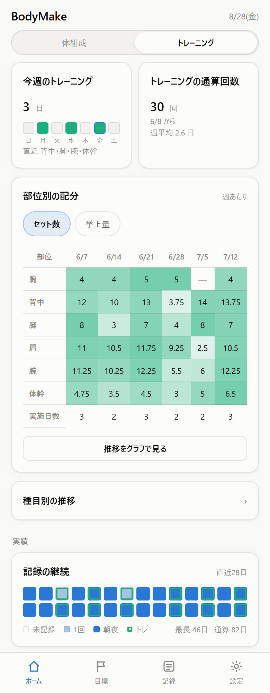
</p>

## なぜ作ったか

体重は水分や食事で1日のうちに1〜2kg動きます。単日の数字を見ていると、増えた減ったに一喜一憂して続きません。

そこで朝夕2回はかって平均を取り、7日移動平均でノイズを均し、週ごとに体組成へ分解する。この手順をExcelで回していました。計算そのものは困りません。困ったのは外出先で開けないことで、これが記録の途切れる原因になっていました。

やっていることは変えず、記録する場所だけスマホに移したのがこのアプリです。

## できること

ヘッダの切り替えで、どの画面も体組成とトレーニングの2面を持ちます。

### 体組成を記録する

<p>
  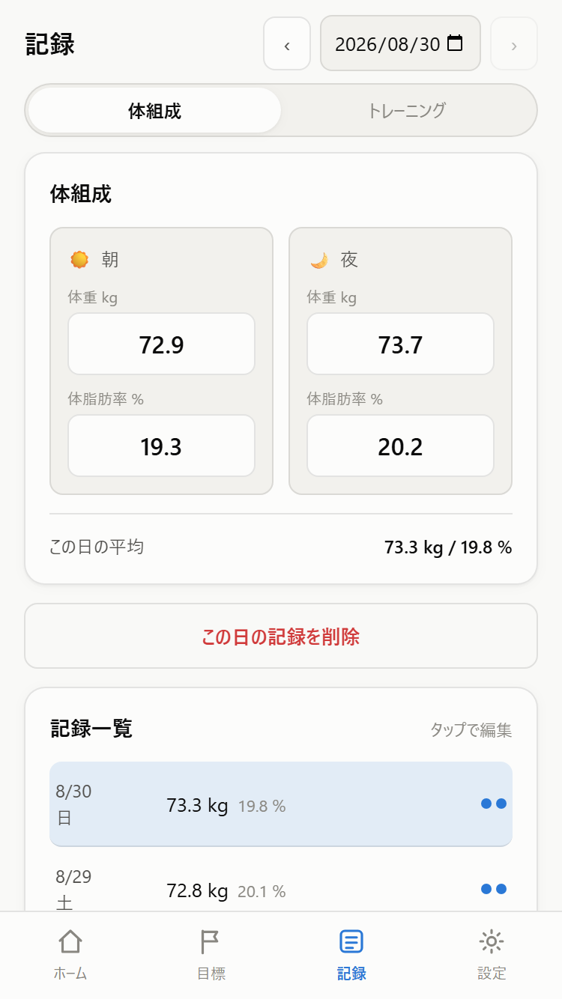
  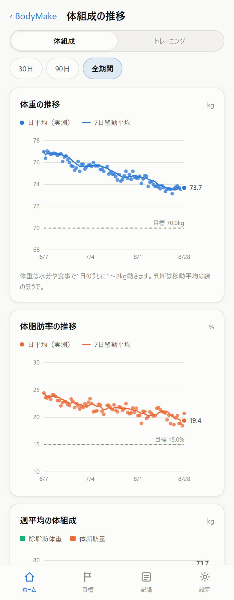
</p>

朝と夜の体重と体脂肪率を記録します。片方しかはかれなかった日も、そのまま残せます。入力は2つの枠に打ち込むだけで、過去の日はいつでも遡って直せます。

判断に使うのは7日移動平均の線です。単日のブレは主線から外してあります。体重の増減は体脂肪量と除脂肪体重に分けて表示するので、除脂肪体重を保ったまま体脂肪量だけ落ちているかが読めます。

### 結果を見る・目標を決める

<p>
  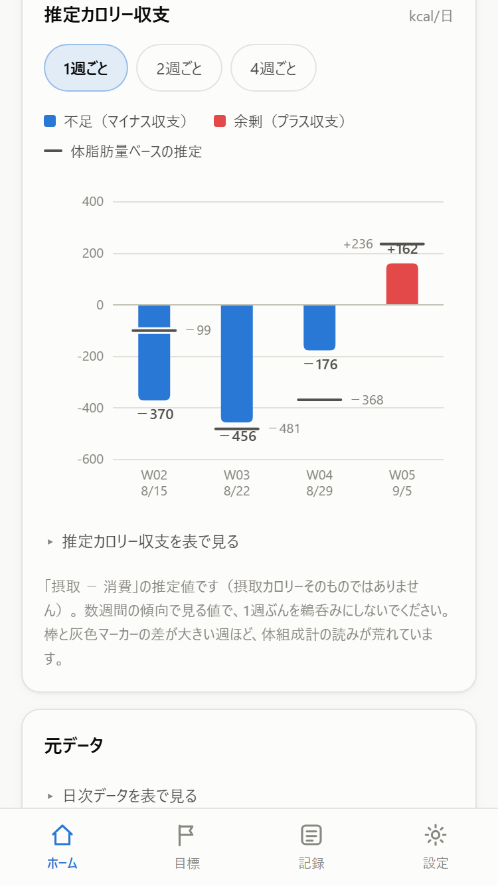
  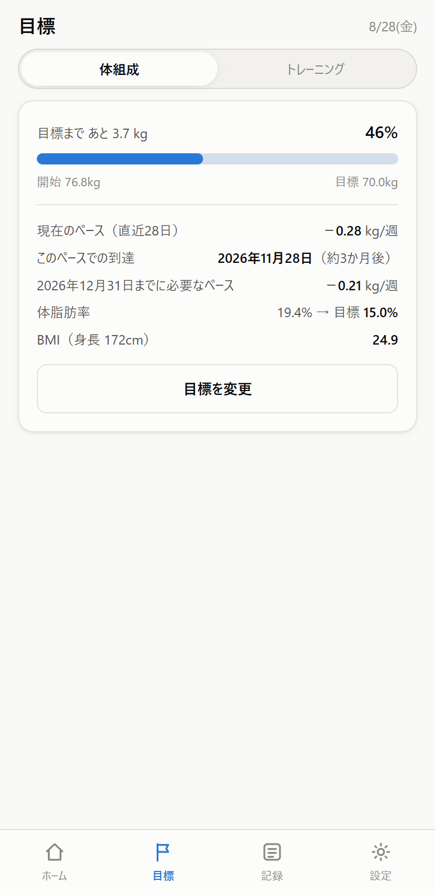
</p>

推移だけでなく、直近のペースと目標までの距離も確認できます。

カロリー収支は、週平均の差をkcal/日に換算した推定値です。体重ベースと体脂肪量ベースを並べているので、その乖離の大きさから体組成計をどこまで信じてよいかも見当がつきます。到達予測は直近28日のペースからの逆算で、残りは進捗バーで示します。

体組成の目標も、週の部位別セット数も、種目ごとの目標も、進捗を見ながらその場で決め直せます。目標に関する操作は1画面に集めました。

### 筋トレを記録する

<p>
  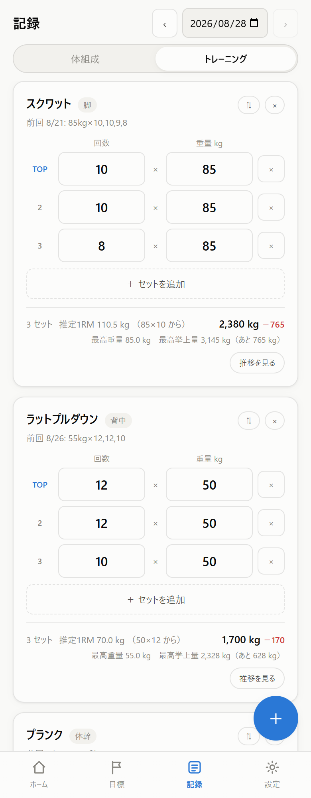
  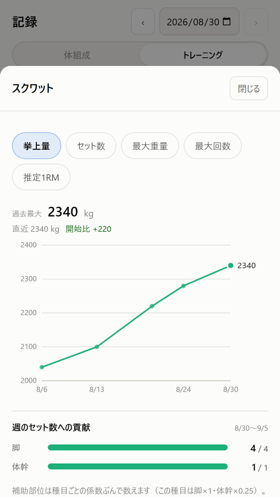
  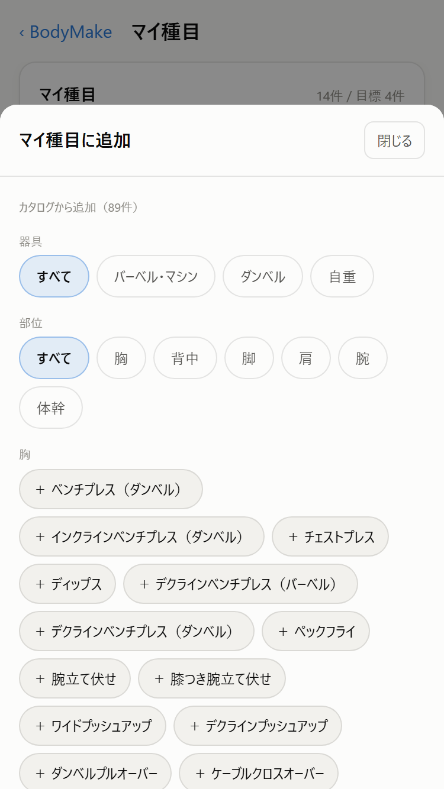
</p>

筋トレはセット単位で記録します。種目ごとに挙上量、セット数、最大重量、推定1RMの推移を確認できます。

最初から90種すべてが記録画面に並ぶことはありません。カタログから、自分が実際にやる種目だけを選んで手元に置きます。右下の ＋ は押したまま動かすと置き場所を変えられます（読みたい行を塞いだときに逃がせます）。離すと左右どちらかの端に寄り、高さを覚えます。前回のセット構成は種目ごとに複製できますし、過去の記録やプリセットからその日のメニューをまとめて呼び出すこともできます。種目カードには通算の最高記録と、そこまでの残りが出ます。打った値が消える操作（セット行の削除、その日から種目を外す）は確認してから実行します。空の行は失うものがないので確認しません。

有酸素も同じ画面で記録します。入力するのは**距離(m)と時間(分)**で、速度(m/分)はそこから出します。距離は m、時間は秒の整数で保存するので、プールの25mも45秒も丸められずに入ります。合計・目標・推移もすべて入力と同じ単位でそろえてあります。**繰り返す種目か、1回で完結する種目かをカタログが持っています。**ランニングやサイクリングは入力欄が2つ出るだけで、行を足すボタンも連番も出ません。水泳やサーキットのように本数そのものが量になる種目では、分けて記録できます。種目ごとに設定から変えられるので、走る人がインターバルもやる場合も切り替えられます。距離のない種目（縄跳びなど）は時間だけで扱い、速度は出しません。推移では距離・時間・速度を切り替えて見られ、目標もこの3つから選べます。

有酸素の種目は**速度が同じ物差しに乗るかどうか**で分けています。水泳はクロール・平泳ぎ・背泳ぎ・バタフライが別種目で、水中ウォーキングはさらに別です。自転車も屋外とエアロバイクで分けています（エアロバイクの距離は機種ごとの推定なので、屋外の実距離と同じ数字として扱えません）。逆に歩き方のバリエーションは分けていません（1回の中で混ぜてやるもので、分けても時間しか入らないため）。

有酸素は部位ではないので、**部位別セット数・週の配分・回復・部位目標には入りません**（筋肥大の回復モデルはランニングには当てはまりません）。実施日数と連続記録には入ります。走った日はトレーニングした日です。目標画面には部位と別に「有酸素」の行があり、その週の回数と時間が出ます。

やらなくなった種目は非表示にできます。外れるのは記録やプリセットで**選ぶときの候補から**だけで、記録はそのまま残り、推移では今までどおり見られます。マイ種目の「非表示」欄から、いつでも表示に戻せます。削除のほうはその種目の記録ごと消えるので、種目を入れ替えたいだけなら非表示を使ってください。

### 配分と伸びを見る

<p>
  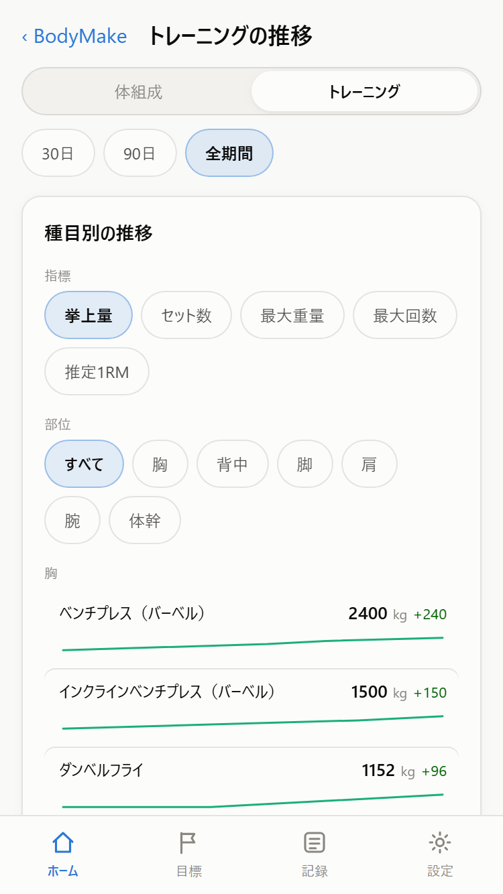
  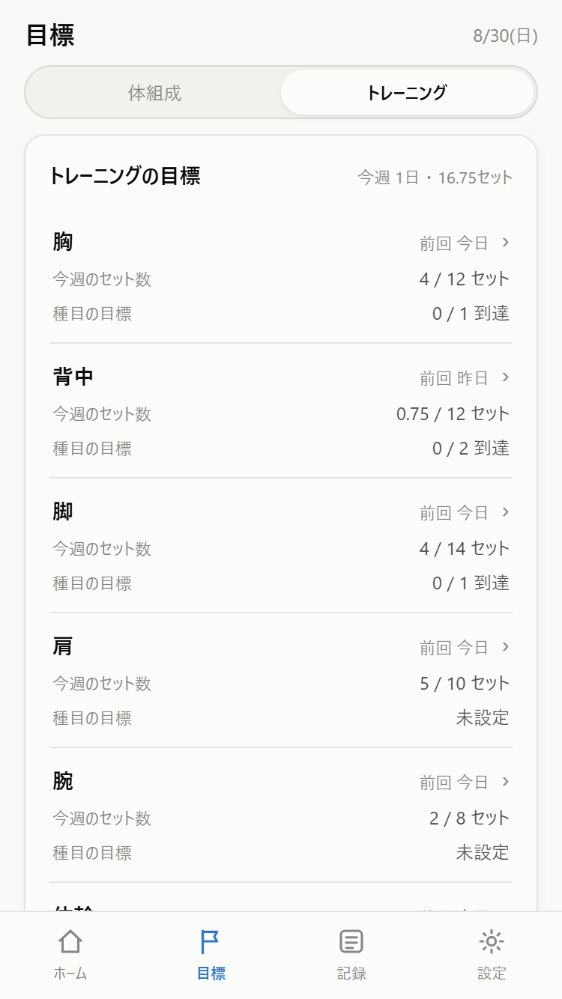
  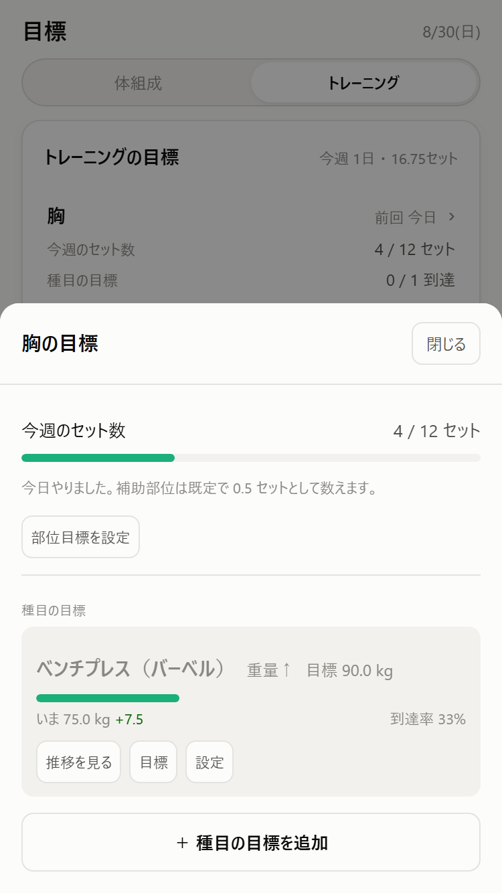
</p>

今週どの部位をどれだけやったかと、その種目が伸びているかは、別々に追います。部位の一覧では数値を並べるだけにして、セット数の目標や種目ごとの目標を決めるところは、その部位を開いた先にまとめました。

週と部位で集計したセット数と挙上量を見れば、どこをサボっているかが分かります。種目ごとの目標は重量でも回数や秒数でも決められて、判定には実際に扱えた重量を使います。

続けるための仕掛けとして、連続記録日数、28日分の記録カレンダー、実績バッジがあります。バッジは体組成30種とトレーニング30種で、ホームの切り替えに合わせて出し分けます。記録は端末内にのみ保存され、サーバーへは何も送りません。アカウントは要らず、オフラインで動きます。

### 組んだメニューをレビューする

おすすめメニューを作る機能ではありません。

デッドリフト、スクワット、RDLのような軸荷重種目が連日になっていないか。セット数から見て、1回のトレーニングが時間に収まりそうか。記録された内容から、この2点をチェックします。

<p>
  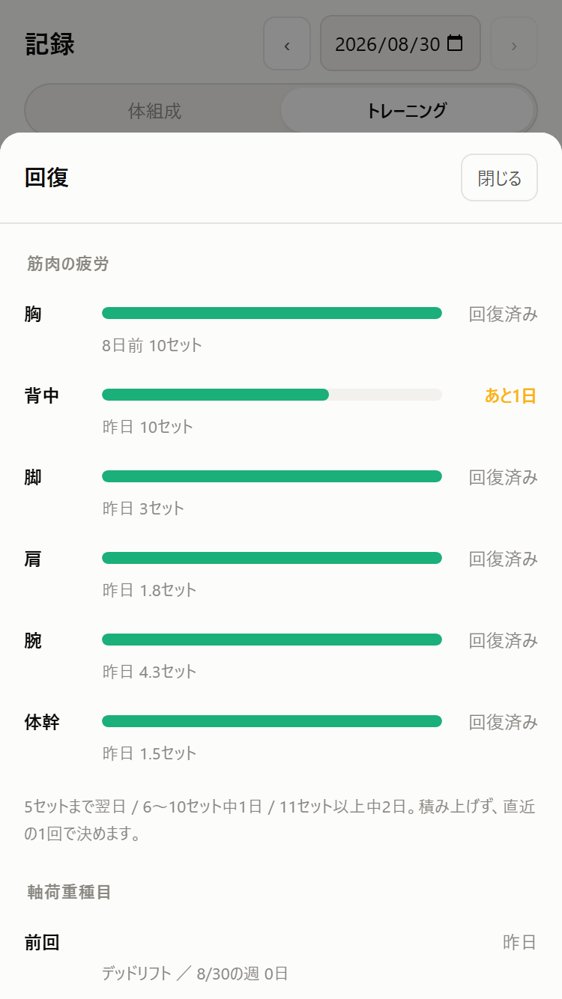
</p>

背骨に荷重を通す種目を続けて置けば、前者が出ます。後者が出るのは回復コストの低い種目にセットが偏ったときで、セット数と1セットの時間の積だけが伸びていきます。

指摘には改善するならを添えています。これは悪いトレーニングですと評価するのではなく、この条件を避けたいならこう変えると判定から外れます、というところまでを示すためです。

設定 > トレーニング > トレーニング種目のレビュー で有効にすると、記録画面に表示されます。既定では無効です。

あわせて、今日この部位をやってよいかを日数で出します。空ける日数はそのセッションのセット数から決めていて、5セットまでなら翌日、6〜10セットなら1日空け、11セット以上で2日空けます。最大でも3日です。種目ごとの設定は必要なく、主部位と補助部位に係数をかけて出した部位別セット数をそのまま使います。

軸荷重種目だけは日数に換算しません。待てば戻るものとして扱わず、前回置いた日そのものを表示します。

## スマホで使う

本番URLをスマホのブラウザで開き、ホーム画面に追加します。オフラインでも起動し、アドレスバーのないアプリとして開きます。

自分でホストする場合は [デプロイ](#デプロイ) を参照してください。

> デモには作成者の記録（体組成35日・筋トレ17日・種目26件・プリセット5件）が初期データとして入っています。デモは開き直すたびにそこへ戻るので、自分の記録をつけるなら本番URLか自前のホストを使ってください。
>
> この初期データが入るのはデモ向けのビルドだけです。`.env.demo` の `VITE_DEMO=1` が渡るのは `npm run build:demo` と `npm run deploy:demo` だけで、`npm run build` で作ったものには入りません。自分でホストすれば空の状態から始まります。

## 開発

```bash
npm install
npm run dev      # http://localhost:5173
```

| コマンド | 内容 |
| --- | --- |
| `npm run dev` | 開発サーバー |
| `npm run build` | 型チェック＋本番ビルド（`dist/`） |
| `npm run preview` | ビルド結果をローカル配信 |
| `npm run typecheck` | 型チェックのみ |
| `npm run test` | 導出ロジックと画面の結線をテスト |
| `npm run bench` | 入力 1 回ぶんの重さを測る（1 / 5 / 10 年ぶんの生成データ） |
| `npm run build:demo` | デモ向けビルド。作者の実測値を初期データに入れる |
| `npm run licenses` | 配布物に含まれる第三者コードを一覧 |
| `npm run licenses:check` | 未申告があれば異常終了。CI用 |
| `npm run deploy:prod` | 本番をビルドして Cloudflare へデプロイ（初期データなし） |

Service Worker は本番ビルドでのみ有効です。ES モジュールと Service Worker が使えないため、`file://` で `index.html` を直接開くことはできません。ローカル確認には `npm run preview` を使ってください。

構成は React 19、TypeScript、SCSS の CSS Modules、Vite です。チャートは外部ライブラリを使わず SVG で描いています。依存を増やさない方針で通していて、ランタイムの依存は React だけです。

## 計算の定義

| 項目 | 定義 |
| --- | --- |
| 日平均 | 朝と夜の平均。片方だけの日はある方をそのまま採用 |
| 7日移動平均 | 後方7日窓。欠測日は分母から除外 |
| 週 | 日曜〜土曜 |
| 週平均 | 週内の日平均の平均。欠測日は分母から除外 |
| 体脂肪量 | 週平均体重 × 週平均体脂肪率 ÷ 100（近似） |
| 除脂肪体重 | 週平均体重 − 体脂肪量 |
| 開始値 | 記録のある最初の7日の平均 |
| ペース | 直近28日の日平均体重を線形回帰した傾き（kg/週） |
| 到達予測 | 現在の7日移動平均とペースから逆算。方向が逆のときと3年超は表示しない |
| 推定カロリー収支 | N週離れた週平均の差 × 7,200 kcal/kg ÷ 日数。N は 1、2、4週から選択 |
| 有効重量 | 記録した重量を種目の負荷の数え方で換算。左右に1つずつ持つ種目は2倍、自重種目は体重 × 係数を加算 |
| 挙上量 | 有効重量 × レップ数の合計。秒で数える種目はレップ数ではないので計上しない |
| 最大重量 | その日のいちばん重いセットの記録した重量。レップ数に左右されない |
| 推定1RM | 最大重量のセットを `重量 × (1 + レップ ÷ d)` で換算。2〜12レップのときだけ |
| `d` | 種目ごとに設定。ベンチ40、スクワットとデッド33.3、既定30。出典 [FWJ](https://fwj.jp/magazine/rm/) |
| 種目の開始値 | 最初の3セッションの平均。3セッション未満は出さない |
| 軸荷重種目 | 種目ごとの真偽値。量は持たない。判定は記録した日付から出す |
| 部位の空き | 空ける日数を 5セットまで1日、6〜10セット2日、11セット以上3日 で決め、空ける日数から経過日数を引いて出す。積み上げず1セッションぶんが上限。回復の窓は24〜72時間なので3日を超えない |
| セッションの所要時間 | `セット数 × 1セットの時間`。回数は掛けない。セットの長さは休憩がほとんどを占めるため、5回でも10回でもあまり変わらない。±20%ほどずれる粗い見積もり |
| 距離 | その日の合計。何本に分けても合計で数える |
| 速度 | 合計距離 ÷ 合計時間（m/分）。セットごとの平均ではない（短い1本が同じ重みで効かないように）。ペース（分/km）では出さない。小さいほど良い値を混ぜると、自己最高・到達率・停滞判定の向きがその指標だけ反転するため |
| 有酸素の主指標 | 合計距離。距離を記録していない種目は合計時間 |
| レビューの指摘 | 所要時間が上限を超えることと、軸荷重種目が連日になることの2つ。どちらにも改善するならを添える。書くのはその判定が偽になる条件だけで、トレーニングの良し悪しは言わない |

## データの扱い

記録はこの端末のブラウザ（IndexedDB）にのみ保存され、サーバーへは送信されません。裏を返すと、ブラウザのデータを消せば記録も消えます。設定画面から JSON で書き出せるので、ときどきバックアップを取ってください。

以前は localStorage に置いていました。**保存先が変わっても、記録はそのまま引き継がれます。**起動時に IndexedDB が空で、前の版の記録が残っていれば、その場で引き取ります。移行の画面も確認も出しません（利用者から見れば置き場所が変わっただけで、記録は 1 件も変わらないため）。

**引き取ったら、前の版のコピーは消します。**残すとそのコピーは日ごとに古くなり、いつか「それらしく見えるが 1 か月前の記録」になります。空に見えるより、それらしく見えて違うほうが危険です。消しても失うものはありません。古いビルドへ戻したときに空に見えるだけで、記録は IndexedDB にあるので、ビルドを戻せばそのまま出てきます。

一度も IndexedDB を使えていない端末（古いブラウザ・一部のプライベートモード）では、**従来どおり localStorage を使います。**どちらに書くかは起動時に一度だけ決めて、以後は変えません。書き込みのたびに選び直すと、同じ記録が2か所に分かれて残ります。

**移行済みなのに IndexedDB を開けなかったときは、どこにも書きません。**ここで localStorage へ落ちると、移行の時点で止まった記録を本物として見せ、そこへ打ち込んだ内容で上書きしてしまいます。本物は IndexedDB に残ったまま見えなくなります。この場合は記録に一切触らず、「記録を読み出せませんでした / 記録は消えていません」を画面に出して開き直しを促します。次に開けた起動で、そのまま元の記録に戻ります。

書き出しも読み込みも **JSON だけ**です。以前は Excel 用に CSV も書き出していましたが、廃止しました。書き出し口が2つあると、片方がバックアップとして使われます。CSV は体組成と明細しか運べないので、それで復元できると思われた時点で種目・目標・設定が失われます。**戻せる形式だけを出す**ことにしました。

### 消えないようにしていること

保存先が端末のブラウザだけなので、**記録が消える経路を塞ぐ側にも同じだけ書いています。**

**保存できていないときは画面に出します。** 容量が足りない端末やプライベートモードでは、保存先が書けないことがあります。以前はここを黙って握っていたので、打った値は画面に出るのに保存されず、次に開いたときにまとめて消えていました。いまは全画面の上部に出して、その場で JSON を書き出せるようにしています。閉じるボタンは置いていません（閉じたあとに打った値も同じように消えるため）。

書けなかったときと読めなかったときで、**言うことを分けています。**書けないだけなら「いまの内容が失われる」。読めなかったのなら画面は空で表示されているので、言うべきなのは「記録は消えていないので、そのままにしてほしい」のほうです。同じ文面で済ませると、最悪の対応（作り直す・すべて削除して入れ直す）を招きます。

書き込みにタイマーは持たせていません。遅らせるほど、書き終わる前にタブが閉じられる窓が広がるためです。書き込み中に来た変更は、最新のひとつにまとめます。連続して打っているあいだ、途中の版まで書く意味はありません。

**ブラウザに「消さないでほしい」と申請します。** 記録が 1 件でも入ると `navigator.storage.persist()` を 1 回だけ呼びます。通るかどうかを決めるのはブラウザで、断られても動作は変わりません。整理の対象になるのはこのオリジンの保存領域まるごとなので、この申請は保存先が IndexedDB でも localStorage でも同じように効きます。

**ホーム画面への追加を案内します。** 3 日ぶん記録して、まだブラウザのタブで開いている場合だけ、ホームの最後に 1 行出します。オフラインで開けるようになるほか、ブラウザのデータ整理の対象から外れやすくなります。

**しばらく書き出していなければ促します。** 記録が 30 日ぶんを超えて、直近 60 日に JSON を書き出していない場合だけ、ホームの最後にその場で書き出せるカードを出します。

**いま何バイト使っているかを出します。** 設定 > データ の「保存サイズ」です。記録は体組成が 1 日 86 バイト、筋トレが 1 セッション 830 バイトほどで増えます。横に添えている上限は**ブラウザが答えた見積もり**で、こちらでは決め打ちません（IndexedDB の上限は端末の空き容量から決まります）。答えない環境では出しません。

天井そのものより先に効くのは**入力の重さ**のほうです。ただし重いのは保存ではありません。値を 1 つ打つと記録全体から日平均・移動平均・週次集計・種目別の集計を出し直すので、**そちらが保存の 2〜3 倍かかります**（10年ぶん・1,337KB の生成データで、導出 113ms に対して保存 47ms）。しかも自重換算に体重が要る都合で `buildSessions` が日次データに依存しているため、**体重を 1 つ打つだけで筋トレ側の集計まで走り直します**。

保存先を日単位のレコードに割っても、ここは軽くなりません。詰めるなら、打鍵ごとに確定させないこと、次に導出の依存を切ることの順です。

案内はどちらも閉じられて、**閉じてから 30 日は出ません。**永久に消さないのは、30 日前に閉じたときと、90 日ぶんの記録を抱えたいまとでは、失うものの量が違うためです。閉じた日と書き出した日は端末ごとの都合なので、記録（`AppData`）とは別のキーに持ちます。書き出した JSON を別の端末で読んでも、向こうの案内は動きません。

## デプロイ

Cloudflare Workers の static assets で配信します。**デモと自分用を別のワーカーに分けています。**

```bash
npm run cf:login    # 初回のみ
npm run deploy:prod # 本番 bodymake.hashiohiro.workers.dev
npm run deploy:demo # デモ bodymake-demo.hashiohiro.workers.dev
```

違いは**初期データを入れるかどうかの1点**だけです。`deploy:demo` は `npm run build:demo`（`.env.demo` の `VITE_DEMO=1`）で作るので、開いてすぐグラフが動くよう作者の実測値が入ります。`deploy:prod` は素の `npm run build` なので空から始まります。

**別のワーカーなので配信元のオリジンが分かれ、localStorage も別になります。** デモを触っても本番の記録には影響しません。逆に、両方をホーム画面に追加すると別のアプリとして並びます。

本番の配信先は動かせません。その URL の localStorage に記録が入っているので、名前を変えると過去の記録に触れなくなります。設定は `wrangler.jsonc` の1ファイルにまとめてあり、デモは `env.demo` として名前だけを上書きしています。`npm run cf:check` で両方のドライランを流せます。

キャッシュ設定は `public/_headers` にあり、`sw.js` と `index.html` を `no-cache`、ハッシュ付きの `assets/*` を1年 immutable にしています。ここは PWA の更新可否に直結するので、変更する際は注意してください。

Service Worker は `autoUpdate` 設定です。ホーム画面に追加済みの端末では、**次に開いたときに新しいビルドを取得し、そのまた次の起動から反映**されます。

## 構成

```text
src/
  types.ts          ドメイン型
  lib/
    date.ts             ローカル日付ユーティリティ（UTC を経由しない）
    derive.ts           日平均・移動平均・週次集計・統計・到達予測
    energy.ts           週平均の差からの推定カロリー収支
    training.ts         有効重量・挙上量・推定1RM・週次配分・種目の目標
    check.ts            レビュー（所要時間・軸荷重の連日）と部位の空き
    exerciseCatalog.ts  種目カタログ90種（選択肢の一覧。初期データではない）
                        ＋ 軸荷重種目の表と、1セットの時間の上書き
    db.ts               IndexedDB の最小ラッパ（依存なし。記録を 1 レコードで持つ）
    storage.ts          保存先の選択・旧版からの引き取り・入力値のサニタイズ
    device.ts           端末ごとの覚え書き（最後に書き出した日・案内を閉じた日）
    io.ts               JSON の書き出しと読み込み
    badges.ts           実績バッジの判定
  hooks/            状態管理・テーマ・数値入力・要素幅計測
  components/
    charts/         依存ライブラリなしの SVG チャート
  views/            ホーム / 目標 / 記録 / 設定
                    ＋ 推移（ホームの下位画面。体組成 / トレーニングで出し分け）
  components/
    training/       筋トレの記録・グラフ・種目管理
  styles/
    _tokens.scss    配色・角丸・タイポのトークン（ライト／ダーク）
    ui.module.scss  カード・ボタン・表など共有の見た目
scripts/
  licenses.mjs      配布物から第三者コードを洗い出す
```

地は単色です。配色ごとのグラデーションは持ち込んでいません。スクロール位置や端末によって切り出す位置が変わり、ヘッダだけ色が違って見える原因になったためです。

色はすべて `_tokens.scss` の CSS カスタムプロパティを経由します。ダークテーマは OS 設定の `prefers-color-scheme` とアプリ内トグルの `data-theme` の両方に対応します。グラフの系列色は実体に固定してあり、体重は青、体脂肪はオレンジ、除脂肪はアクア。ライトとダークの両モードで色覚多様性の分離条件を満たす組み合わせを選びました。全グラフに表ビューがあるので、色が見分けにくい環境でも値には到達できます。

## ライセンス

MIT License — [LICENSE.txt](LICENSE.txt)

配布物に含まれる第三者コードの帰属は [THIRD-PARTY-NOTICES.txt](THIRD-PARTY-NOTICES.txt) に分離しています。この一覧は依存関係の一覧ではありません。`npm run licenses` がビルド成果物のソースマップから実際に同梱されたモジュールを再構成して照合しています。