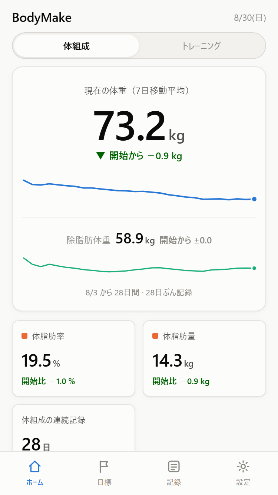
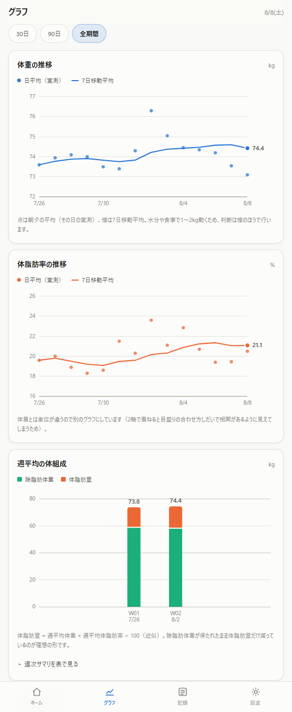

# BodyMake

[](LICENSE.txt)
[](#スマホで使う)

体重と体脂肪率を朝夕2回記録し、週次のトレンドと体組成の変化を追うための PWA。
筋トレの記録と、種目ごとの伸びも追えます。
Excel でつけていた記録表を、スマホからいつでも開けるアプリに置き換えたものです。

**デモ: https://bodymake.hashiohiro.workers.dev**

<p>
  
  
</p>

## なぜ作ったか

体重は水分や食事で1日のうちに1〜2kg動きます。単日の数字を見ていると、増えた減ったに一喜一憂して続きません。

そこで「朝夕2回計測 → その日の平均 → 7日移動平均でノイズを均す → 週次で体組成に分解する」という手順を Excel で回していました。計算は合っているのですが、**外出先で開けない**のが致命的で、記録が途切れる原因になっていました。同じ計算をそのまま持ち込んで、スマホから開けるようにしたのがこれです。

## できること

- **単日のブレに振り回されない** — 7日移動平均を主線にして判断する
- **体組成で見る** — 体重の増減を体脂肪量と除脂肪体重に分解する。除脂肪体重を保ったまま体脂肪量だけ落ちているかが分かる
- **カロリー収支の推定** — 週平均の差を kcal/日 に換算する。体重ベースと体脂肪量ベースを並べ、乖離の大きさから体組成計の信頼度も読める
- **目標到達の予測** — 直近28日のペースから到達日を逆算し、進捗バーで残りを示す
- **続けるための仕掛け** — 連続記録日数、28日分の記録カレンダー、17種の実績バッジ
- **筋トレを種目ごとに追う** — セット単位で記録し、挙上量・セット数・最大重量・推定1RMの推移を種目ごとに見る
- **部位の配分が見える** — 週 × 部位のセット数と挙上量。どこをサボっているかが分かる
- **種目ごとの目標** — 重量でも回数（秒数）でも決められる。判定は実際に扱えた重量で
- **記録は数タップ** — 前回のセット構成を種目ごとに複製、その日の献立は過去の記録やプリセットからまとめて呼び出せる
- **目標は1画面で完結** — 体組成の目標も、週の部位別セット数も、種目ごとの目標も、進捗を見ながらその場で決め直せる
- **アカウント不要・オフライン動作** — 記録は端末内にのみ保存。サーバーへ何も送らない

## スマホで使う

デモ URL をスマホのブラウザで開き、「ホーム画面に追加」。オフラインでも起動し、アドレスバーのないアプリとして開きます。

自分でホストする場合は [デプロイ](#デプロイ) を参照してください。

> デモには作者の実測値14日分が初期データとして入っています。自分用に使うなら、設定画面の「すべての記録を削除」で消せます。

## 開発

```bash
npm install
npm run dev      # http://localhost:5173
```

| コマンド | 内容 |
| --- | --- |
| `npm run dev` | 開発サーバー |
| `npm run build` | 型チェック＋本番ビルド（`dist/`） |
| `npm run preview` | ビルド結果をローカル配信 |
| `npm run typecheck` | 型チェックのみ |
| `npm run test` | 導出ロジックと画面の結線をテスト |
| `npm run licenses` | 配布物に含まれる第三者コードを一覧 |
| `npm run licenses:check` | 未申告があれば異常終了（CI 用） |
| `npm run deploy` | ビルドして Cloudflare へデプロイ |

Service Worker は本番ビルドでのみ有効です。`file://` で `index.html` を直接開くことはできません（ES モジュールと Service Worker が使えないため）。ローカル確認は `npm run preview` を使ってください。

**技術構成** — React 19 / TypeScript / SCSS（CSS Modules）/ Vite。チャートは外部ライブラリを使わず SVG で実装しています。ランタイム依存は React のみです。

## 計算の定義

| 項目 | 定義 |
| --- | --- |
| 日平均 | 朝と夜の平均。片方だけの日はある方をそのまま採用 |
| 7日移動平均 | 後方7日窓。欠測日は分母から除外 |
| 週 | 日曜〜土曜 |
| 週平均 | 週内の「日平均」の平均。欠測日は分母から除外 |
| 体脂肪量 | 週平均体重 × 週平均体脂肪率 ÷ 100（近似） |
| 除脂肪体重 | 週平均体重 − 体脂肪量 |
| 開始値 | 記録のある最初の7日の平均 |
| ペース | 直近28日の日平均体重を線形回帰した傾き（kg/週） |
| 到達予測 | 現在の7日移動平均とペースから逆算。方向が逆・3年超は表示しない |
| 推定カロリー収支 | N週離れた週平均の差 × 7,200 kcal/kg ÷ 日数。N は 1 / 2 / 4 週から選択 |
| 有効重量 | 記録した重量を種目の「負荷の数え方」で換算。左右に1つずつ持つ種目は2倍、自重種目は体重 × 係数を加算 |
| 挙上量 | 有効重量 × レップ数の合計。秒で数える種目は計上しない（レップ数ではないため） |
| 最大重量 | その日のいちばん重いセットの**記録した重量**。レップ数に左右されない |
| 推定1RM | 最大重量のセットを `重量 × (1 + レップ ÷ d)` で換算。2〜12レップのときだけ。 |
| | `d` は種目ごと（ベンチ40 / スクワット・デッド33.3 / 既定30、出典 [FWJ](https://fwj.jp/magazine/rm/)） |
| 種目の開始値 | 最初の3セッションの平均。3セッション未満は出さない |

## 設計上の判断

**体重と体脂肪率のグラフを分けている。** 元の Excel は2軸で重ねていましたが、2軸グラフは目盛りの合わせ方が任意なので、実際にはない相関が見えてしまいます。単位の違う量は別のグラフにしています。

**開始値を初日1点にしていない。** 初日の測定値を基準にすると、その日たまたま多かった／少なかった分がすべての差分に乗り続けます。最初の7日の平均を基準にしています。

**カロリー収支は体重ベースを主にしている。** 体組成計（インピーダンス式）の体脂肪率は水分・食事・測定時刻で大きく振れ、実データでも2週間で17.9%〜23.6%の幅がありました。体脂肪量ベースの推定は数百 kcal 単位でずれます。棒（体重ベース）と灰色のマーカー（体脂肪量ベース）の差が大きい週ほど、体組成計の読みが荒れていると考えてください。

**挙上量を種目や部位をまたいで合計しない。** スクワットの1,500kgとサイドレイズの900kgを足した数字は、何が動いたのかを説明しません。セット数・レップ数の合計も同じで、どの種目のセットかが分からなければ配分も強度も読めません。挙上量もセット数も種目ごとに出しています。

**体組成とトレーニングを同じグラフに並べない。** 除脂肪体重はインピーダンス式の推定値で振れが大きく、動かす要因もトレーニングだけではありません。同じx軸に並べた時点で「関係がある」と主張することになるため、ヘッダの切り替えで別々に出しています。

**目標は設定ではなく、独立したタブに置いています。** 目標体重も週の部位別セット数も種目の目標も、進捗を見ながら何度も変わります。設定に置くと「あと3.2kg」を見る場所と、その3.2kgを決め直す場所が離れます。目標タブは進捗と編集を同じカードに持ち、設定には滅多に変えない定義（種目そのもの・表示・データ）だけを残しています。

**推移はタブではなく、その数字の続きに置いています。** ホームの体組成／トレーニングそれぞれの最後から入ります。推移は独立した機能ではなく、いま見ている数字の詳細だからです。

**推定1RMは同じ種目の推移を見るための換算値です。** 実際に1回挙げられる重量の予測ではありません。何レップできるかと1RMの何%かの関係は種目でも個人でも変わるので、種目をまたいで比べる意味もありません。目標の判定にも使わず、実際に扱えた最大重量で見ます。

いずれも数週間分の傾向として見る値です。1週分の値を鵜呑みにしないでください。**医療的・栄養学的な助言ではありません。**

## データの扱い

記録はブラウザの localStorage にのみ保存され、サーバーへは送信されません。裏を返すと、ブラウザのデータを消すと記録も消えます。設定画面から JSON / CSV で書き出せるので、ときどきバックアップを取ってください。

復元に使えるのは JSON だけです。CSV は元の Excel と同じ列構成（日次記録＋週次分析）に、筋トレのセット単位の明細と週次の部位別セット数を足したものを BOM 付きで出力します。Excel でそのまま開いてピボットできますが、**書き出し専用**です（これで復元できると思われると設定が失われるため、読み込みは JSON だけにしています）。

## デプロイ

Cloudflare Workers の static assets で配信します。

```bash
npm run cf:login   # 初回のみ
npm run deploy
```

`wrangler.jsonc` の `name` がプロジェクト名です。キャッシュ設定は `public/_headers` にあり、`sw.js` と `index.html` を `no-cache`、ハッシュ付きの `assets/*` を1年 immutable にしています。ここは PWA の更新可否に直結するので、変更する際は注意してください。

Service Worker は `autoUpdate` 設定です。ホーム画面に追加済みの端末では、**次に開いたときに新しいビルドを取得し、そのまた次の起動から反映**されます。

## 構成

```
src/
  types.ts          ドメイン型
  lib/
    date.ts             ローカル日付ユーティリティ（UTC を経由しない）
    derive.ts           日平均・移動平均・週次集計・統計・到達予測
    energy.ts           週平均の差からの推定カロリー収支
    training.ts         有効重量・挙上量・推定1RM・週次配分・種目の目標
    exerciseCatalog.ts  種目カタログ75種（選択肢の一覧。初期データではない）
    storage.ts          localStorage 永続化と入力値のサニタイズ
    io.ts               JSON 入出力と CSV 書き出し
    badges.ts           実績バッジの判定
  hooks/            状態管理・テーマ・数値入力・要素幅計測
  components/
    charts/         依存ライブラリなしの SVG チャート
  views/            ホーム / 目標 / 記録 / 設定
                    ＋ 推移（ホームの下位画面。体組成 / トレーニングで出し分け）
  components/
    training/       筋トレの記録・グラフ・種目管理
  styles/
    _tokens.scss    配色・角丸・タイポのトークン（ライト／ダーク）
    ui.module.scss  カード・ボタン・表など共有の見た目
scripts/
  licenses.mjs      配布物から第三者コードを洗い出す
```

地は単色です（配色ごとのグラデーションは持ち込んでいません。スクロール位置や端末で切り出す位置が変わり、ヘッダだけ色が違って見える原因になったため）。色はすべて `_tokens.scss` の CSS カスタムプロパティ経由で、ダークテーマは OS 設定（`prefers-color-scheme`）とアプリ内トグル（`data-theme`）の両方に対応します。グラフの系列色は「体重＝青／体脂肪＝オレンジ／除脂肪＝アクア」で実体に固定し、色覚多様性の分離条件をライト・ダーク両モードで満たす組み合わせを選んでいます。全グラフに表ビューがあるので、色が見分けにくい環境でも値に到達できます。

## ライセンス

MIT License — [LICENSE.txt](LICENSE.txt)

配布物に含まれる第三者コードの帰属は [THIRD-PARTY-NOTICES.txt](THIRD-PARTY-NOTICES.txt) に分離しています。この一覧は依存関係の一覧ではなく、`npm run licenses` が **ビルド成果物のソースマップから実際に同梱されたモジュールを再構成**して照合しています。

> `src/lib/seed.ts` の初期データは作者本人の実測値です。フォークして自分用に使う場合、`const ROWS: Row[] = [];` と空にすれば初期データなしで始められます。

<details>
<summary>開発環境のメモ（OneDrive 配下で作業する場合）</summary>

OneDrive 同期フォルダに `node_modules` を置くと、ネイティブバイナリを持つパッケージで問題が起きます。WSL と Windows の両方から `npm install` すると、プラットフォーム依存のバイナリが片方だけになったり、npm のリネームが失敗してディレクトリエントリが壊れたりします（`stat` は「存在しない」、`mkdir` は「既に存在する」と返す状態になります）。

対処:

```bash
npm install --no-save @rollup/rollup-linux-x64-gnu sass-embedded-linux-x64   # 足りない側を補う
rm -rf node_modules package-lock.json && npm install                          # または作り直す
```

根本的には、プロジェクトを OneDrive の外に置き、WSL と Windows のどちらか一方から開発するのが安全です。

</details>
